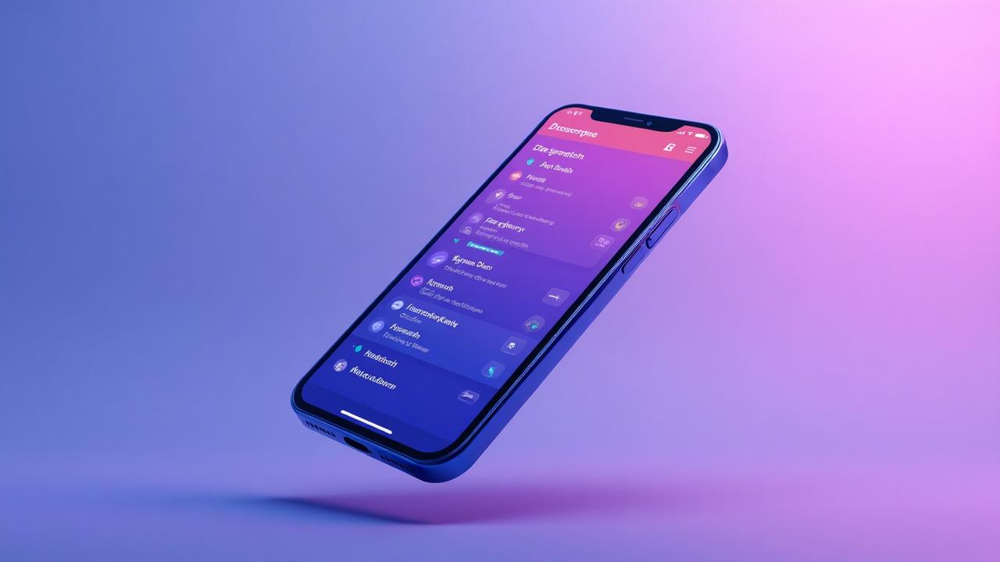

# TaskFlow - Todo Task Management Mobile App



A beautiful, cross-platform Todo Task Management Mobile Application built for the Katomaran Hackathon. TaskFlow enables users to organize their life with an intuitive, mobile-first interface featuring social authentication, full CRUD operations, and smooth animations.

## 🚀 Features

### 🔐 Authentication
- **Social Login**: Support for Google, GitHub, Facebook, and Apple authentication
- **Secure Authentication Flow**: Proper error handling and loading states
- **Persistent Sessions**: Auto-login for returning users

### 📱 Task Management
- **Full CRUD Operations**: Create, Read, Update, Delete tasks
- **Task Fields**: Title, description, due date, status (open/complete), priority (low/medium/high)
- **Smart Filtering**: Filter by status, search functionality, and sorting options
- **Priority System**: Visual priority indicators with color coding
- **Due Date Tracking**: Overdue task detection and notifications

### 🎨 User Experience
- **Mobile-First Design**: Optimized for touch interactions on iOS and Android
- **Beautiful UI Components**: Modern design with gradients, shadows, and animations
- **Bottom Navigation**: Intuitive tab-based navigation
- **Floating Action Button**: Quick task creation access
- **Pull-to-Refresh**: Native mobile gestures
- **Swipe Actions**: Quick task management with swipe gestures
- **Smooth Animations**: Engaging micro-interactions and transitions

### 📊 Dashboard & Analytics
- **Progress Overview**: Visual completion rates and statistics
- **Today's Tasks**: Quick access to due tasks
- **Overdue Alerts**: Clear indication of overdue tasks
- **Achievement System**: Gamification with productivity scores
- **Weekly Statistics**: Performance tracking over time

## 🛠️ Tech Stack

- **Frontend**: React 18 + TypeScript
- **Mobile**: Capacitor for cross-platform deployment
- **UI Components**: shadcn/ui with Radix UI primitives
- **Styling**: Tailwind CSS with custom design system
- **State Management**: React Context API
- **Routing**: React Router
- **Date Handling**: date-fns
- **Icons**: Lucide React
- **Build Tool**: Vite
- **Authentication**: Mock social providers (ready for real OAuth integration)

## 🏗️ Architecture

The app follows a modern React architecture with:

- **Context-based State Management**: Separate contexts for authentication and task management
- **Component-based Architecture**: Reusable UI components with proper separation of concerns
- **Mobile-First Design System**: Consistent theming with CSS custom properties
- **TypeScript**: Full type safety throughout the application
- **Responsive Design**: Optimized for mobile devices with fallback for desktop

### Architecture Diagram

```
┌─────────────────────────────────────────────────────────────┐
│                        App.tsx                              │
│  ┌─────────────────┐ ┌──────────────────┐ ┌─────────────┐  │
│  │  AuthProvider   │ │   TaskProvider   │ │ QueryClient │  │
│  └─────────────────┘ └──────────────────┘ └─────────────┘  │
└─────────────────────────────────────────────────────────────┘
                                │
                        ┌───────▼───────┐
                        │  Index.tsx    │
                        │ (Main Router) │
                        └───────┬───────┘
                                │
        ┌───────────────────────┼───────────────────────┐
        │                       │                       │
   ┌────▼────┐          ┌──────▼──────┐         ┌──────▼──────┐
   │ Login   │          │   Mobile    │         │  Profile    │
   │ Screen  │          │ Dashboard   │         │   Screen    │
   └─────────┘          └─────┬───────┘         └─────────────┘
                              │
        ┌─────────────────────┼─────────────────────┐
        │                     │                     │
   ┌────▼────┐        ┌──────▼──────┐       ┌──────▼──────┐
   │ Home    │        │  Task List  │       │   Search    │
   │ Screen  │        │   Screen    │       │   Screen    │
   └─────────┘        └─────────────┘       └─────────────┘
```

## 🚀 Getting Started

### Prerequisites
- Node.js 18+ and npm
- For mobile deployment: Android Studio (Android) or Xcode (iOS)

### Installation

1. **Clone the repository**
   ```bash
   git clone <repository-url>
   cd taskflow-mobile
   ```

2. **Install dependencies**
   ```bash
   npm install
   ```

3. **Start development server**
   ```bash
   npm run dev
   ```

4. **For mobile deployment:**
   ```bash
   # Build the project
   npm run build
   
   # Add mobile platforms
   npx cap add ios
   npx cap add android
   
   # Sync project with mobile platforms
   npx cap sync
   
   # Run on mobile device/emulator
   npx cap run android
   npx cap run ios
   ```

### Environment Setup
The app uses mock authentication by default. For production deployment, configure real OAuth providers in the `AuthContext.tsx` file.

## 📱 Mobile Features

### Touch Optimized
- **Large Touch Targets**: All interactive elements are 44px+ for accessibility
- **Gesture Support**: Swipe-to-delete, pull-to-refresh
- **Native Scrolling**: Smooth, momentum-based scrolling
- **Haptic Feedback**: Ready for native haptic integration

### Cross-Platform
- **iOS Support**: Native iOS styling and behaviors
- **Android Support**: Material Design compliance
- **Web Fallback**: Works seamlessly in mobile browsers
- **Responsive**: Adapts to different screen sizes

## 🎯 Assumptions Made

1. **Authentication**: Mock social login implementation - in production, would integrate with real OAuth providers
2. **Data Persistence**: Local storage for demo purposes - production would use cloud database
3. **Offline Support**: Basic offline functionality through local storage
4. **Push Notifications**: UI prepared but requires native implementation
5. **Real-time Updates**: Single-user assumption - multi-user would require WebSocket integration

## 🔧 Configuration

### Capacitor Configuration
The app is configured for mobile deployment with:
- App ID: `app.lovable.2fd83f3e4c45411fb9558d9bf5e7220a`
- Hot reload enabled for development
- Splash screen configuration
- Cross-platform compatibility

### Design System
Custom design tokens defined in `src/index.css`:
- Color palette optimized for mobile screens
- Typography scale for readability
- Spacing system for touch interfaces
- Animation timings for smooth interactions

## 🧪 Testing

The app includes:
- **Type Safety**: Full TypeScript coverage
- **Error Boundaries**: Graceful error handling
- **Loading States**: Proper loading indicators
- **Empty States**: Meaningful no-data experiences
- **Responsive Testing**: Works across device sizes

## 🚀 Deployment

### Web Deployment
```bash
npm run build
# Deploy the 'dist' folder to any static hosting service
```

### Mobile App Store Deployment
1. Build the app: `npm run build`
2. Sync with Capacitor: `npx cap sync`
3. Open in native IDE: `npx cap open ios` or `npx cap open android`
4. Build and publish through respective app stores

## 📈 Performance Optimizations

- **Code Splitting**: Component-based code splitting
- **Image Optimization**: Proper image sizing and formats
- **Bundle Size**: Optimized dependencies and tree-shaking
- **Animation Performance**: Hardware-accelerated animations
- **Memory Management**: Proper component cleanup

## 🤝 Contributing

This project was built as part of a hackathon. For future development:

1. Fork the repository
2. Create a feature branch: `git checkout -b feature/amazing-feature`
3. Commit changes: `git commit -m 'Add amazing feature'`
4. Push to branch: `git push origin feature/amazing-feature`
5. Open a Pull Request

## 📄 License

This project is open source and available under the [MIT License](LICENSE).

## 🏆 Hackathon Submission

**Video Demo**: [Loom Recording](https://your-loom-video-link-here)

### Key Highlights
- ✅ Social Authentication (Multiple providers)
- ✅ Full CRUD Task Management
- ✅ Mobile-Optimized UI/UX
- ✅ Smooth Animations & Transitions
- ✅ Pull-to-Refresh & Swipe Gestures
- ✅ Cross-Platform Compatibility
- ✅ Responsive Design
- ✅ Progress Tracking & Analytics
- ✅ Clean Code Architecture
- ✅ TypeScript Implementation

---

**This project is a part of a hackathon run by https://www.katomaran.com**